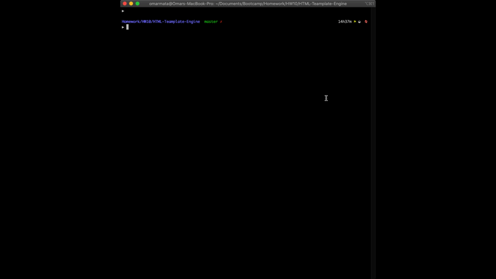

# HTML Renderer

 
  
## Description

Using the terminal, a manager is quickly able to assemble an HTML page to display a roster of a given number of Engineers and Interns. Primarily uses inquirer to gather user input from the terminal then takes the input to generate an HTMl page that is exported to the _output_ folder in the repository. 
  
## Table of Contents
  
[Installation](#Installation)  
[Usage](#Usage)  
[License](#License)  
[Contributing](#Contributing)  
[Tests](#Tests)  
[Questions](#Questions)  
  
## Installation 
  
Node is needed on the machine running the application in order to be able to call the program's json packages. The application needs the full repo to have the appropriate resources to call the program and output the result to the ouput folder.
  
## Usage

This is an image of a team of 3:

[Link to Google Drive MP4 version](https://drive.google.com/file/d/1oVZCp5KUmxoAqAInF8YgnQSr7jtTeIeg/view)
  
## License
  
Licensed under the MIT license.
  
## Contributing
  
Contributions are always welcome to develop the application to be more dynamically responsive with more screen sizes.
  
## Tests
  
Program uses *jest* testing to help test each object property.

Additionally, application validates inputs from terminal so they are appropriate inputs. Here is an example of this validation:

  
## Questions

Link to my [GitHub Profile](https://github.com/omata48)
For additional questions feel free to email omata48@gmail.com
    